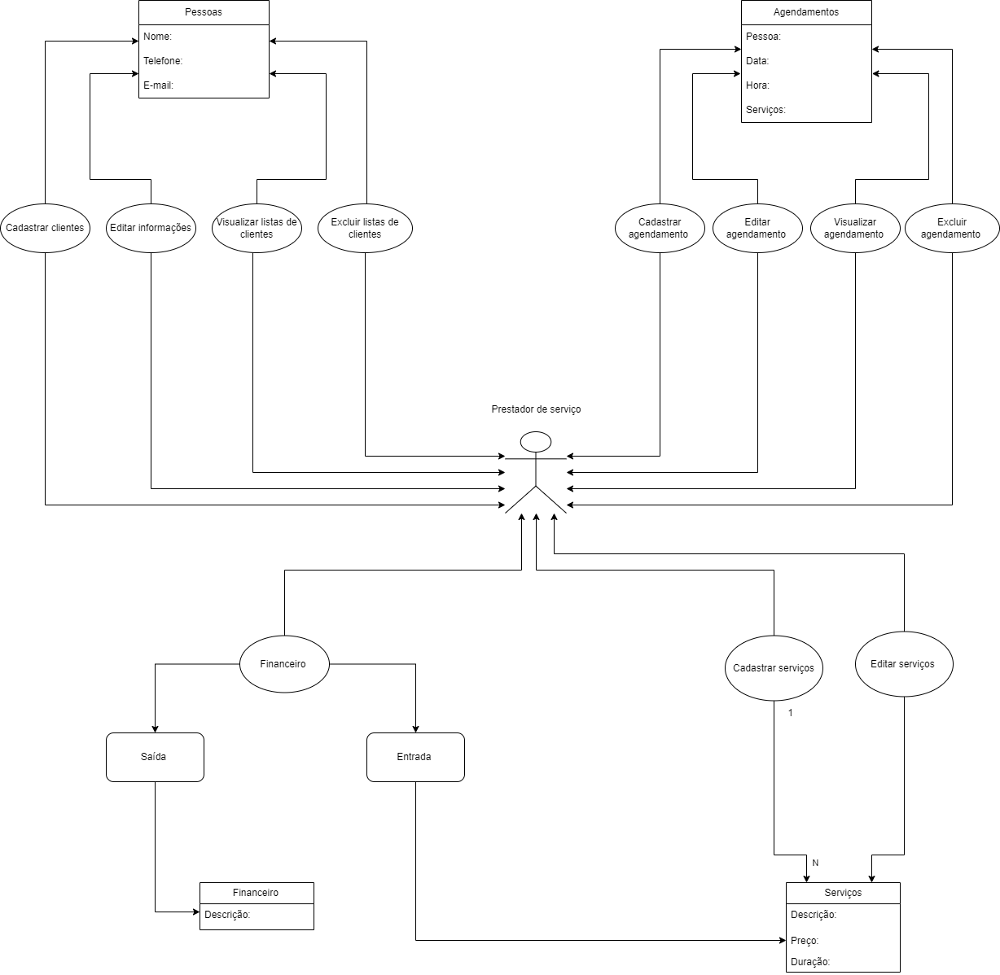

# Introdução

Texto descritivo com a visão geral do projeto abordado. Inclui o contexto, o problema, os objetivos, a justificativa e o público-alvo do projeto.

## Problema
Prestadores de serviços frequentemente enfrentam dificuldades na gestão eficiente de suas agendas e finanças, o que pode levar a problemas como a sobrecarga de compromissos, dificuldades no acompanhamento dos pagamentos, e falta de controle sobre despesas adicionais. A ausência de uma solução integrada que combine funcionalidades de agendamento com controle financeiro resulta em uma administração fragmentada e ineficaz. Sem um sistema centralizado, esses profissionais tendem a usar métodos manuais e desconexos, como planilhas e anotações físicas, o que pode resultar em erros, falta de precisão e perda de tempo. A necessidade de um software que ofereça uma abordagem integrada para o gerenciamento de compromissos e finanças é evidente para melhorar a eficiência operacional e o controle financeiro desses prestadores.

## Objetivos

-Objetivo Geral
Desenvolver um software de gestão integrada que permita aos prestadores de serviços gerenciarem eficientemente sua agenda e suas finanças, centralizando o controle de compromissos e transações financeiras em uma única plataforma para melhorar a organização e a administração de suas atividades profissionais.

-Objetivos Específicos
1.	Criar um módulo de agendamento de compromissos:
Desenvolver uma funcionalidade que permita aos usuários registrem, visualizem e gerenciem compromissos futuros.
2.	Implementar um Módulo de Controle Financeiro:
Criar funcionalidades que possibilitem o registro e acompanhamento de receitas e despesas relacionadas aos serviços prestados.
3.	Desenvolver Ferramentas de Relatórios Financeiros:
Implementar recursos que gerem relatórios e gráficos sobre a situação financeira, ajudando os usuários a visualizarem e analisarem
 suas finanças e o desempenho dos serviços prestados.

## Justificativa

O mercado nacional oferece diversas soluções em matéria de sistemas de gestão empresarial, conhecidos como ERP (Enterprise Resource Planning). Segundo o site da Mobills (2024), podemos apresentar, como exemplo, o TOTVS Protheus e o Conta Azul, entre outros. Em comum, todos estes sistemas estão voltados para pequenos, médios e grandes negócios.

Observando-se este cenário, foi possível identificar a ausência de software voltado para o trabalhador autônomo, que carece de ferramenta de apresentação mais simplificada com leque de funcionalidades mais reduzidos, quando comparados às alternativas mencionadas anteriormente, mas que forneça funcionalidades que estejam na medida de suas necessidades operacionais.

## Público-Alvo

Profissionais de natureza autônoma, com nível educacional variado, que não desejam investir em software sofisticado para gestão de agendamentos e para gestão financeira de seus serviços e que, portanto, buscam solução simplificada que permita, via web ou mobile, acompanhar os gastos com insumos, os valores recebidos e a receber, os compromissos com clientes, e gerar relatórios com dados de interesse para seu negócio.

# Especificações do Projeto

## Requisitos

As tabelas que se seguem apresentam os requisitos funcionais e não funcionais que detalham o escopo do projeto. Para determinar a prioridade de requisitos, aplicar uma técnica de priorização de requisitos e detalhar como a técnica foi aplicada.

### Requisitos Funcionais

|ID    | Descrição do Requisito  | Prioridade |
|------|-----------------------------------------|----|
|RF-001| Permitir que o usuário cadastre tarefas | ALTA | 
|RF-002| Emitir um relatório de tarefas no mês   | MÉDIA |

### Requisitos não Funcionais

|ID     | Descrição do Requisito  |Prioridade |
|-------|-------------------------|----|
|RNF-001| O sistema deve ser responsivo para rodar em um dispositivos móvel | MÉDIA | 
|RNF-002| Deve processar requisições do usuário em no máximo 3s |  BAIXA | 

Com base nas Histórias de Usuário, enumere os requisitos da sua solução. Classifique esses requisitos em dois grupos:

- [Requisitos Funcionais
 (RF)](https://pt.wikipedia.org/wiki/Requisito_funcional):
 correspondem a uma funcionalidade que deve estar presente na
  plataforma (ex: cadastro de usuário).
- [Requisitos Não Funcionais
  (RNF)](https://pt.wikipedia.org/wiki/Requisito_n%C3%A3o_funcional):
  correspondem a uma característica técnica, seja de usabilidade,
  desempenho, confiabilidade, segurança ou outro (ex: suporte a
  dispositivos iOS e Android).
Lembre-se que cada requisito deve corresponder à uma e somente uma
característica alvo da sua solução. Além disso, certifique-se de que
todos os aspectos capturados nas Histórias de Usuário foram cobertos.

## Restrições

O projeto está restrito pelos itens apresentados na tabela a seguir.

|ID| Restrição                                             |
|--|-------------------------------------------------------|
|01| O projeto deverá ser entregue até o final do semestre |
|02| Não pode ser desenvolvido um módulo de backend        |

Enumere as restrições à sua solução. Lembre-se de que as restrições geralmente limitam a solução candidata.

> **Links Úteis**:
> - [O que são Requisitos Funcionais e Requisitos Não Funcionais?](https://codificar.com.br/requisitos-funcionais-nao-funcionais/)
> - [O que são requisitos funcionais e requisitos não funcionais?](https://analisederequisitos.com.br/requisitos-funcionais-e-requisitos-nao-funcionais-o-que-sao/)

# Catálogo de Serviços

Descreva aqui todos os serviços que serão disponibilizados pelo seu projeto, detalhando suas características e funcionalidades.

# Caso de Uso 

# Arquitetura da Solução

Definição de como o software é estruturado em termos dos componentes que fazem parte da solução e do ambiente de hospedagem da aplicação.

## Tecnologias Utilizadas

Descreva aqui qual(is) tecnologias você vai usar para resolver o seu problema, ou seja, implementar a sua solução. Liste todas as tecnologias envolvidas, linguagens a serem utilizadas, serviços web, frameworks, bibliotecas, IDEs de desenvolvimento, e ferramentas.

Apresente também uma figura explicando como as tecnologias estão relacionadas ou como uma interação do usuário com o sistema vai ser conduzida, por onde ela passa até retornar uma resposta ao usuário.

## Hospedagem

Explique como a hospedagem e o lançamento da plataforma foi feita.

> **Links Úteis**:
>
> - [Website com GitHub Pages](https://pages.github.com/)
> - [Programação colaborativa com Repl.it](https://repl.it/)
> - [Getting Started with Heroku](https://devcenter.heroku.com/start)
> - [Publicando Seu Site No Heroku](http://pythonclub.com.br/publicando-seu-hello-world-no-heroku.html)
